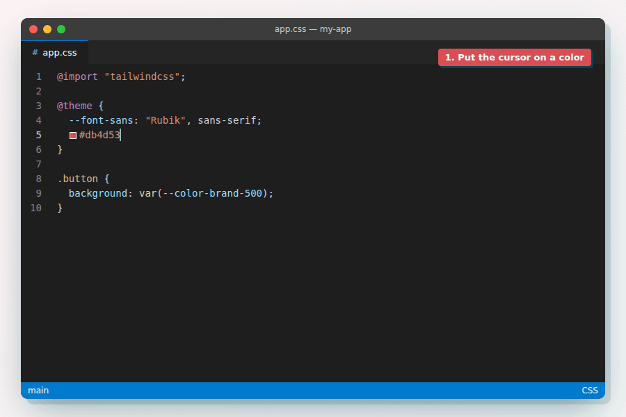

# Tailwind CSS Shades

Generate a full [Tailwind CSS](https://tailwindcss.com/) color palette (`50` to `950`) from any color, right in your editor. Works with **Tailwind v4, v3, v2 and v1**.

**[VS Code Marketplace](https://marketplace.visualstudio.com/items?itemName=bourhaouta.tailwindshades)** · **[Open VSX](https://open-vsx.org/extension/bourhaouta/tailwindshades)** (Cursor, Windsurf, VSCodium)



## Usage

1. Select a color, or just put the cursor on it: `#db4d53`, `rgb(…)`, `hsl(…)`, `oklch(…)` or a CSS color name.
2. Press <kbd>Cmd</kbd>+<kbd>K</kbd> <kbd>Cmd</kbd>+<kbd>G</kbd> (macOS) or <kbd>Ctrl</kbd>+<kbd>K</kbd> <kbd>Ctrl</kbd>+<kbd>G</kbd>, or run **Tailwind Shades: Generate color palette** from the Command Palette.
3. Pick a name. The closest Tailwind color is suggested; type your own (like `brand`) to keep Tailwind's color too.

With no color under the cursor, the extension asks you for one.

### Tailwind v4 (CSS file)

```css
@theme {
  --color-brand-50: oklch(97.1% 0.012 16.784);
  --color-brand-100: oklch(91.4% 0.03 17.121);
  --color-brand-200: oklch(84.1% 0.058 17.738);
  --color-brand-300: oklch(74.2% 0.106 18.975);
  --color-brand-400: oklch(61.6% 0.177 21.62);
  --color-brand-500: oklch(56.4% 0.22 24.735);
  --color-brand-600: oklch(51.8% 0.228 26.729);
  --color-brand-700: oklch(46.1% 0.198 26.922);
  --color-brand-800: oklch(41.5% 0.164 26.303);
  --color-brand-900: oklch(38.1% 0.131 25.127);
  --color-brand-950: oklch(25.8% 0.085 25.446);
}
```

Already inside an `@theme { … }` block? Only the variables are added.

### Tailwind v3 (`tailwind.config.js`)

```js
brand: {
  50: '#fdf2f3',
  100: '#fae2e3',
  200: '#f6c9cc',
  300: '#efa5a9',
  400: '#e7757a',
  500: '#db4d53',
  600: '#ca373c',
  700: '#aa2c30',
  800: '#8d272b',
  900: '#772528',
  950: '#411012',
},
```

## How the shades are made

The palette follows Tailwind's own colors instead of simply mixing with white and black:

- It finds the Tailwind color closest to yours, and copies how that color's lightness, saturation and hue change from light to dark.
- **Your color stays exactly as it is**, at the shade where it fits best. A light color can become `200`, not always `500`.
- The math happens in [OKLCH](https://oklch.com), the color space Tailwind v4 uses, so the steps look even to the eye.

## Tailwind versions

The version is read from the closest `package.json` (`tailwindcss` dependency). Without one, v4 is used.

| Version | Shades | In CSS files | In JS/TS files | Colors |
| --- | --- | --- | --- | --- |
| v4 | 50–950 | `@theme` block | config object | OKLCH |
| v3 | 50–950 | CSS variables | config object | hex |
| v2 | 50–900 | CSS variables | config object | hex |
| v1 | 100–900 | CSS variables | config object | hex |

Each version uses its own default palette as the reference, so a v1 palette looks like v1 colors.

## Commands

| Command | What it does |
| --- | --- |
| **Generate color palette** | Picks the version and output for you (see above). Shortcut: <kbd>Ctrl/Cmd</kbd>+<kbd>K</kbd> <kbd>Ctrl/Cmd</kbd>+<kbd>G</kbd> |
| **Generate color palette (choose version and output)…** | Asks which Tailwind version and output to use |
| **Generate color palette as CSS variables** | Always writes `--brand-500: …;` variables |

## Settings

| Setting | Default | Options |
| --- | --- | --- |
| `tailwindshades.tailwindVersion` | `auto` | `auto`, `4`, `3`, `2`, `1` |
| `tailwindshades.colorFormat` | `auto` (OKLCH for v4, hex before) | `auto`, `oklch`, `hex`, `rgb` |
| `tailwindshades.output` | `auto` (from the file type) | `auto`, `theme`, `config`, `cssVariables` |
| `tailwindshades.promptForName` | `true` | Ask for the color name |

## Development

```sh
npm install
npm run check   # type check + tests
npm run build   # bundle to dist/
```

Press <kbd>F5</kbd> in VS Code to try the extension in a new window. After upgrading a `tailwindcss` dev dependency, run `npm run palette` to refresh the reference palettes.

## License

[MIT](LICENSE) © Omar Bourhaouta
